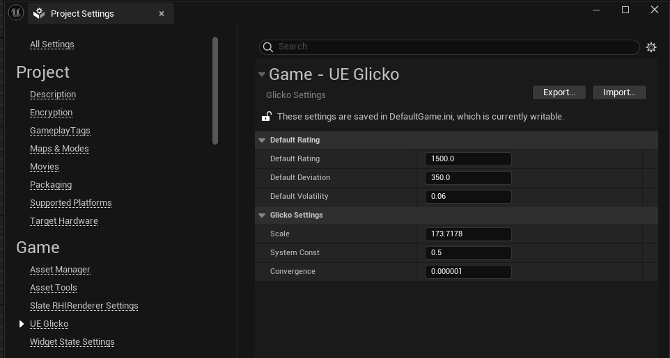
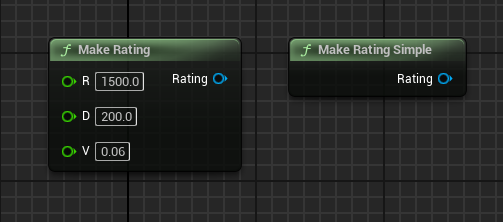
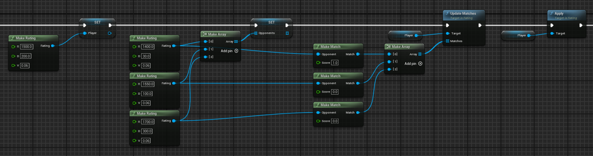
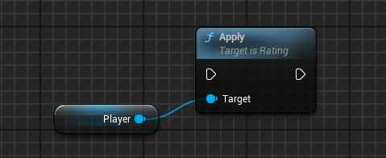

# UE Glicko Package
An Unreal Engine implementation of the Glicko-2 player rating system.

[Unity Version](https://github.com/CondorHalcon/UnityGlicko)

## Usage
The rating system has two components: the configuration and rating objects. The values in `Glicko` described all of the configurable components and can be changed in the project settings in `Edit -> ProjectSettings -> UE Glicko`; this includes the default rating values and system constants. Details of how to configure the rating system are described in the [Glicko-2 paper](http://www.glicko.net/glicko/glicko2.pdf).



---

New player ratings can be created as follows:

```cpp
    // Create a new Rating instance with the default rating
    static const UGlickoSettings* Glicko = UGlickoSettings::GetGlickoSettings();
    URating* r = URating::MakeRatingSimple();

    // Create a new Rating instance with a specific rating
    URating* r = URating::MakeRating(1500);

    // Create a new Rating instance with a specific rating and deviation
    URating* r = URating::MakeRating(1500, 200);

    // Create a new Rating instance with a specific rating, deviation and volatility
    URating* r = URating::MakeRating(1500, 310, 0.04);
``` 



---

In the Glicko rating system, player ratings are updated in batches. As described in the [Glicko-2 paper](http://www.glicko.net/glicko/glicko2.pdf), the ideal number of games in a rating period is 10-15. As such, the primary method for updating a rating is the `URating::Update()` method. This arguments to the `URating::Update()` method are a game count, an array of opponent ratings and the outcome of the games. As per the Glicko-2 paper, a victor has the score `1.0`, a draw is scored as `0.5` and a loss is `0.0`.

```cpp
    // The test player
    URating* player = URating::MakeRating(1500, 200);

    // Three opponents
    URating* opponent1 = URating::MakeRating(1400, 30);
    URating* opponent2 = URating::MakeRating(1550, 100);
    URating* opponent3 = URating::MakeRating(1700, 300);

    // Update the rating from the 3 games
    TArray<FMatch> matches = TArray<FMatch>();
    matches.Add(FMatch::MakeMatch(opponent1, 1.0));
    matches.Add(FMatch::MakeMatch(opponent2, 0));
    matches.Add(FMatch::MakeMatch(opponent3, 0));

    player->Update(matches);
    player->Apply();
```



---

A version of `URating::Update()` that takes a single opponent and game outcome can also be used. This method is useful in situations where the ratings are updated with each game, such as an online chess environment:

```cpp
    // Player1's rating
    URating* player1 = URating::MakeRating(1500, 200);

    // Player2's rating
    URating* player2 = URating::MakeRating(1400, 30);

    // Update the ratings based on a game in which player1 beat player2
    player1->Update(FMatch::MakeMatch(player2, 1.0));
    player2->Update(FMatch::MakeMatch(player1, 0.0));

    player1->Apply();
    player2->Apply();
```


---

If a player does not play any games during a rating period, the Glicko-2 document recommends that their rating deviation is updated based on the volatility, as described in Step 6 of the Glicko pdf. This can be achieved using the `URating::Decay()` function:

```csharp
    player->Decay();
```


---

After calling `URating::Update()` or `URating::Decay()`, the changes must be applied using the `URating::Apply()` method. This is necessary because updates to multiple `URating` instances may depend on each other and ratings should be not updated until all outcomes have been processed.

```csharp
    player->Apply();
```



---

# License
This implementation of the Glicko-2 rating system is distributed under [The MIT License](https://opensource.org/licenses/MIT).